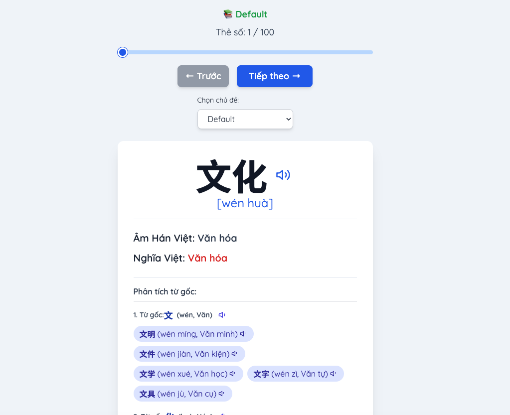

## Xây một web flashcard Hán Việt đơn giản nhưng "đủ xài"

Dự án `flashcard` là một web app nhỏ, chạy thuần HTML/CSS/JS, giúp học từ vựng tiếng Trung theo kiểu flashcard. Trong bài viết này mình chia sẻ lại cách mình thiết kế, tổ chức dữ liệu và triển khai tính năng – theo góc nhìn "học mà làm".

**Demo:** [Flashcard Hán Việt online](https://thanhtoan0306.github.io/flashcard/)

[](https://thanhtoan0306.github.io/flashcard/)

---

### Bài toán: Học Hán Việt mà không cần backend

Mục tiêu ban đầu rất rõ:

- **Học từ vựng tiếng Trung**: Hán tự + Pinyin + Hán Việt + nghĩa tiếng Việt
- **Không cần backend, không cần build tool** – chỉ cần mở `index.html` là chạy
- **Dễ mở rộng chủ đề**: thêm một file JSON là có thêm một bộ flashcard
- **Ưu tiên trải nghiệm học**: phát âm, phân tích từng chữ, giao diện dễ dùng

Từ đó mình chọn kiến trúc:

- **Một file `index.html`** chứa UI + logic JavaScript
- **Nhiều file `.json`** lưu data flashcard theo từng chủ đề
- Chạy **local server đơn giản** (Python/Node) để tránh lỗi CORS khi load JSON

---

### Cấu trúc dữ liệu: Tất cả xoay quanh JSON

Mỗi chủ đề là một file JSON (ví dụ: `dinosaurs.json`, `hospital.json`, `vegetables.json`...). Mỗi file là một mảng các object với format như sau:

```json
{
  "hanzi": "恐龙",
  "pinyin": "kǒng lóng",
  "hanviet": "Khủng long",
  "vietnamese": "Khủng long",
  "char1": {
    "hanzi": "恐",
    "pinyin": "kǒng",
    "hanviet": "Khủng",
    "words": [
      {
        "hanzi": "恐龙",
        "pinyin": "kǒng lóng",
        "hanviet": "Khủng long",
        "vietnamese": "Khủng long"
      }
    ]
  },
  "char2": {
    "hanzi": "龙",
    "pinyin": "lóng",
    "hanviet": "Long",
    "words": []
  }
}
```

- **Trường bắt buộc**:
  - `hanzi`, `pinyin`, `hanviet`, `vietnamese`
- **Trường tuỳ chọn**:
  - `char1`, `char2`, `char3`…: dùng để **phân tích từng chữ Hán** trong từ ghép
  - Bên trong `charX.words` là các từ ghép liên quan đến chữ đó

Cách làm này giúp mình:

- **Dễ parse trên client**: chỉ cần `fetch` + `JSON.parse`
- **Tách rõ data và UI**: đổi nội dung không đụng tới JavaScript
- **Linh hoạt mở rộng**: muốn thêm chủ đề chỉ cần thêm file JSON mới

---

### Giao diện & UX: Tối giản nhưng có "đủ đồ chơi"

Toàn bộ UI nằm trong `index.html` với HTML + Tailwind CSS.

**Các phần chính:**

- **Dropdown chọn chủ đề**: app có sẵn hơn 10 chủ đề như:
  - `default.json`, `dinosaurs.json`, `hospital.json`, `kitchen.json`, `body.json`, `smartphone.json`, `planets.json`, `study_supplies.json`, `vegetables.json`, `dishes.json`, `drinking.json`, `radicals.json`...
- **Flashcard chính**:
  - Hán tự lớn (dễ nhìn)
  - Pinyin
  - Hán Việt
  - Nghĩa tiếng Việt
- **Điều hướng**:
  - Nút next/prev hoặc thanh trượt để chuyển thẻ
- **Phân tích từ gốc**:
  - Hiển thị từng ký tự (`char1`, `char2`…) và các từ ghép liên quan
  - Hữu ích nếu bạn muốn nhớ từ theo "bộ + nghĩa gốc"
- **Responsive**:
  - Dùng Tailwind để layout co giãn tốt trên cả mobile và desktop

---

### Phát âm: Tận dụng Web Speech API

Để thêm phần "sống" cho flashcard, mình dùng **Web Speech API** của trình duyệt:

- Khi người dùng bấm icon 🔊, app:
  - Tạo `SpeechSynthesisUtterance` với text là `hanzi` hoặc `pinyin`
  - Chọn voice tiếng Trung (nếu trình duyệt hỗ trợ)
  - Gọi `speechSynthesis.speak()`

Một vài lưu ý thực tế:

- Web Speech API phụ thuộc vào trình duyệt:
  - Chrome/Edge hoạt động ổn nhất
  - Cần kết nối internet để một số giọng đọc hoạt động
- Nếu không có voice tiếng Trung, app vẫn chạy nhưng phát âm không thật sự chuẩn – chấp nhận được với scope dự án cá nhân.

---

### Luồng hoạt động của app

1. **Load ban đầu**:
   - Đọc danh sách file JSON được khai báo trong `index.html` (mảng `jsonFiles`)
   - Tự động thêm vào dropdown chủ đề

2. **Người dùng chọn chủ đề**:
   - App `fetch` file JSON tương ứng
   - Parse dữ liệu thành danh sách flashcard trong memory

3. **Hiển thị flashcard**:
   - Render thẻ hiện tại: Hán tự, Pinyin, Hán Việt, nghĩa
   - Render phân tích ký tự nếu có `char1`/`char2`…

4. **Điều hướng**:
   - Nút next/prev cập nhật index hiện tại
   - Thanh trượt cho phép nhảy nhanh tới thẻ bất kỳ

5. **Phát âm**:
   - Click 🔊 → gọi Web Speech API

---

### Cách chạy dự án

**Cách đơn giản nhất:**

```bash
git clone https://github.com/thanhtoan0306/flashcard.git
cd flashcard

# Mở trực tiếp index.html trong trình duyệt
```

Tuy nhiên để tránh lỗi CORS khi load JSON, nên chạy qua local server:

**Python:**

```bash
python3 -m http.server 8000
# Truy cập: http://localhost:8000
```

**Hoặc Node.js:**

```bash
npx http-server
# Truy cập: http://localhost:8080 (tuỳ tool)
```

---

### Thêm một chủ đề mới chỉ trong vài bước

1. Tạo file JSON mới, ví dụ: `animals.json`, theo đúng format dữ liệu
2. Thêm file đó vào mảng `jsonFiles` trong `index.html`
3. Reload page:
   - Chủ đề mới sẽ tự động xuất hiện trong dropdown
   - Không cần sửa thêm JavaScript

Mục tiêu ở đây là: **người khác fork repo có thể tự thêm bộ từ vựng của họ mà không phải chạm sâu vào code**.

---

### Tech stack & lý do chọn

- **HTML + JavaScript ES6+**: phù hợp cho một app nhỏ, không cần framework
- **Tailwind CSS**: style nhanh, tiện thử nghiệm layout
- **Web Speech API**: thêm phát âm mà không cần backend
- **JSON thuần**: dễ edit, dễ version control, dễ tái sử dụng

---

### Những gì mình học được từ dự án nhỏ này

- **Data-driven UI**: chỉ cần cấu trúc JSON hợp lý, UI có thể linh hoạt mà code JS không phình to.
- **Bắt đầu từ đơn giản**:
  - Không vội dùng framework, không vội dựng backend
  - Một file HTML duy nhất vẫn có thể giải quyết bài toán rõ ràng
- **Cân bằng giữa "đủ đẹp" và "đủ dùng"**:
  - Tailwind giúp có giao diện sạch, hiện đại mà không tốn quá nhiều thời gian CSS custom
- **Tận dụng API có sẵn của trình duyệt**:
  - Web Speech API là ví dụ điển hình: thêm nhiều giá trị cho trải nghiệm học mà không phải xây thêm service nào khác.

---

Nếu bạn muốn xem source đầy đủ hoặc fork về tự custom chủ đề riêng, có thể xem tại repo `flashcard` trên GitHub: `https://github.com/thanhtoan0306/flashcard`.
